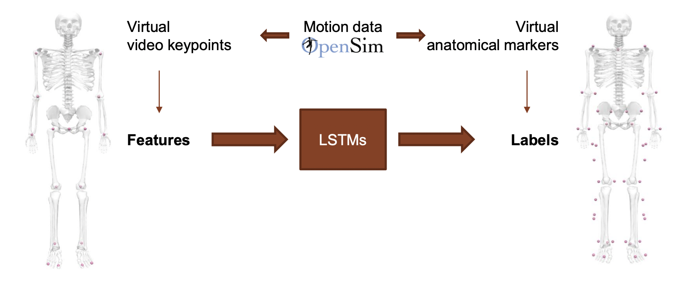

# CS-230: Human Marker Augmentation with Deep Learning using Constraints


## Installation
1. Install [Anaconda](https://www.anaconda.com/)
2. Clone the repository to your machine.
3. Open the Anaconda command prompt and create a conda environment: `conda create -n cs-230-project`
4. Activate the environment: `conda activate cs-230-project`
5. Install [tensorflow with GPU support](https://www.tensorflow.org/install/pip) (you can probably also use CPU only if you train on a small part of the dataset).
6. Install other dependencies. Navigate to the local directory where the repository is cloned, then: `python -m pip install -r requirements.txt`

## Dataset
- A subset of the dataset is available [here](https://drive.google.com/file/d/1zstU911Jc9_Y692pjhk8smBwRnOh5hr1/view?usp=sharing). Download it into /Data. The path of the first feature time sequence should be something like /Data/data_CS230/feature_0.npy.

## Usage

### Training (w/o tuning)
1. Create a new training configuration in `get_lstm_settings` within `mySettings.py` and note the key name.
2. Run `python trainLSTM.py --case KEY_NAME`
3. The model and training history will be stored in `trained_models_LSTM` with the `KEY_NAME` as the prefix for the file name.

See `train.sh` for sample training commands

### Training (with hyperparameter tuning)
1. Create a new training configuration in `get_lstm_tuner_settings` within `mySettings.py` and note the key name.
2. Run `python tuneHyperParametersLSTM.py --case KEY_NAME`
3. The final model will be stored in `trained_models_hyperparameter_tuning_LSTM/Models/KEY_NAME` and the trial history will be stored in `trained_models_hyperparameter_tuning_LSTM/KEY_NAME`.

See `train.sh` for sample training commands

### Testing
1. Store the failure example .trc file in `test/` (say it is named `abc.trc`)
2. Obtain the `KEY_NAME` of the model to be testing (as defined in the training sections)
3. Run `python testLSTM.py --case KEY_NAME --fail_case abc`. If the model was obtained using hyper-parameter tuning (i.e. by running `tuneHyperParametersLSTM.py`) then add the flag `--tuned`.

See `test.sh` for sample test commands

## Overview of Files

**Directory Structure**:
```shell
cs230-project
├── Data
│   └── data_CS230          # Should store data samples
├── archive                 # Stores scripts that are used for initial data splits or are outdated
│   ├── Dockerfile          
│   ├── analyzeDataset.py
│   ├── evaluateLSTM.py
│   ├── infoDatasets.py
│   └── splitData.py
├── assets                  # Stores sample logs and plots (may contain logs from very old runs)
│   ├── logs/
│   └── plots/
├── modeldefs               # Stores the model definition for both training and hyperparameter tuning
│   ├── myModels.py
│   └── myModelsHyperParameters.py
├── mySettings.py           # Stores the configuration to run training and hyperparameter tuning with
├── requirements.txt        # Stores the pre-requisite packages needed to run this project
├── test/                   # Stores the failure test samples generated for qualitative evaluation
├── test.sh                 # Contains sample commands to run testing
├── testLSTM.py             # script to test an LSTM model on a specified failure example.
├── train.sh                # Contains sample commands to run training
├── trainLSTM.py            # script to train LSTM model with fixed hyperparameters.
├── trained_models_LSTM/    # Stores models trained using trainLSTM.py
├── trained_models_hyperparameter_tuning_LSTM/ # Stores models trained tuneHyperParametersLSTM.py
├── tuneHyperParametersLSTM.py # script to tune certain hyperparameters and train best LSTM model.
└── utils                   # Stores various utility scripts
    ├── dataman.py          
    ├── myDataGenerator.py
    └── utilities.py
```

**Main files**:
- `myModels.py`: script describing the model architecture for trainLSTM.py and loss functions.
- `trainLSTM.py`: script to train LSTM model with specified fixed hyperparameters.
- `myModelsHyperParameters.py`: script describing the model architecture for tuneHyperParametersLSTM.py.
- `tuneHyperParametersLSTM.py`: script to tune certain hyperparameters and train best LSTM model.
- `testLSTM.py`: script to test an LSTM model on a specified failure example.
- `mySettings.py`: script with some modifiable model settings (for both trainLSTM.py and tuneHyperParametersLSTM.py).
- `utilities.py`: various utilities for getting marker lists and defining relevant segments for constraints.

**Other files (you should not need to interact with these files)**:
- `splitData.py`: script to split the data into different sets.
- `infoDatasets.py`: some details about the dataset.
- `myDataGenerator.py`: script describing the data generator used for training and evaluation.
- `evaluateLSTM.py`: script to evaluate LSTM model.
- `analyzeDataset.py`: script to inspect samples from the dataset.
- `dataman.py`: File definition for importing marker data into OpenSim and conversion utilities
